# TripBazaar Demo Providers Data

This directory contains comprehensive demo data for travel providers in the TripBazaar marketplace application.

## Files Included

- `demo_providers.sql` - Complete demo data with 8 providers and their packages
- `import_demo_providers.sql` - Simple import script
- `schema.sql` - Main database schema (run this first)

## Demo Providers Overview

### 1. Sarah Williams - Romantic Getaways Specialist
- **Company**: Sarah's Romantic Escapes
- **Email**: sarah.travels@tripbazaar.com
- **Specialization**: Romantic packages for couples, honeymoons, anniversaries
- **Commission Rate**: 8.50%
- **Packages**: 3 romantic destinations (Goa, Kashmir, Udaipur)

### 2. Michael Rodriguez - Adventure Hub
- **Company**: Adventure Hub India
- **Email**: adventure.hub@tripbazaar.com
- **Specialization**: Adventure sports, trekking, extreme activities
- **Commission Rate**: 9.00%
- **Packages**: 2 adventure destinations (Rishikesh, Manali)

### 3. Emma Thompson - Luxury Escapes
- **Company**: Elite Luxury Escapes
- **Email**: luxury.escapes@tripbazaar.com
- **Specialization**: Premium luxury travel experiences
- **Commission Rate**: 7.00%
- **Packages**: 2 luxury destinations (Rajasthan, Kerala)

### 4. David Kumar - Family Fun Adventures
- **Company**: Happy Family Travels
- **Email**: family.fun@tripbazaar.com
- **Specialization**: Family-friendly packages with kids activities
- **Commission Rate**: 9.50%
- **Packages**: 2 family destinations (Goa, Rajasthan)

### 5. Lisa Chen - Beach Paradise
- **Company**: Coastal Paradise Tours
- **Email**: beach.paradise@tripbazaar.com
- **Specialization**: Beach destinations and coastal experiences
- **Commission Rate**: 8.00%
- **Packages**: 2 beach destinations (Andaman, Kerala)

### 6. Robert Patel - Mountain Trails
- **Company**: Himalayan Mountain Trails
- **Email**: mountain.trails@tripbazaar.com
- **Specialization**: Mountain destinations and hill stations
- **Commission Rate**: 8.75%
- **Packages**: 2 mountain destinations (Himachal, Leh Ladakh)

### 7. Priya Singh - Cultural Journeys
- **Company**: Heritage Cultural Tours
- **Email**: cultural.journeys@tripbazaar.com
- **Specialization**: Cultural and heritage tours
- **Commission Rate**: 9.25%
- **Packages**: 2 cultural destinations (Golden Triangle, South India)

### 8. James Anderson - Wildlife Safaris
- **Company**: Wild India Safaris
- **Email**: wildlife.safaris@tripbazaar.com
- **Specialization**: Wildlife safaris and nature tours
- **Commission Rate**: 8.25%
- **Packages**: 2 wildlife destinations (Ranthambore, Jim Corbett)

## Package Categories Covered

1. **Adventure** - Rishikesh sports, Manali trekking
2. **Romantic** - Goa honeymoon, Kashmir couples, Udaipur romance
3. **Family** - Family-friendly Goa, Rajasthan heritage
4. **Beach** - Andaman paradise, Kerala backwaters
5. **Mountains** - Himachal hills, Leh Ladakh
6. **Cultural** - Golden Triangle, South India temples
7. **Wildlife** - Tiger safaris, Corbett experience
8. **Luxury** - Royal Rajasthan, Kerala luxury

## Import Instructions

1. **First time setup**:
   ```sql
   -- Import main schema
   SOURCE schema.sql;
   
   -- Import demo providers data
   SOURCE demo_providers.sql;
   ```

2. **Using import script**:
   ```sql
   SOURCE import_demo_providers.sql;
   ```

3. **Via MySQL command line**:
   ```bash
   mysql -u username -p tripbazaar < demo_providers.sql
   ```

## Login Credentials

All demo provider accounts use the password: `password123`

**Provider Login Examples**:
- Sarah: sarah.travels@tripbazaar.com / password123
- Michael: adventure.hub@tripbazaar.com / password123
- Emma: luxury.escapes@tripbazaar.com / password123
- And so on...

## Data Features

### Provider Profiles Include:
- Complete company information
- License numbers and verification status
- Banking details for payouts
- Business addresses across different cities
- Commission rates varying from 7% to 9.50%

### Package Details Include:
- Comprehensive descriptions and inclusions
- Realistic pricing with adult/child/extra room rates
- Terms and conditions
- Featured packages for homepage display
- Customer ratings and review counts
- Booking statistics

### Price Ranges:
- **Budget**: ₹15,000 - ₹35,000 (Adventure, Family basic)
- **Mid-range**: ₹35,000 - ₹55,000 (Most packages)
- **Luxury**: ₹75,000 - ₹120,000 (Premium experiences)

## Testing Scenarios

This demo data enables testing of:

1. **Provider Management**: Different provider types and specializations
2. **Package Browsing**: Variety of categories and price ranges
3. **Search & Filtering**: Multiple destinations and criteria
4. **Booking System**: Different package configurations
5. **Commission Calculations**: Varying commission rates
6. **Featured Content**: Mix of featured and regular packages

## Notes

- All providers are marked as verified and active
- Package images use placeholder paths (update with actual images)
- Realistic review counts and ratings for testing
- Banking details are sample data for demo purposes
- Phone numbers use North American format but can be updated

## Support

For any issues with the demo data, check:
1. Database connection settings
2. Required table structure from schema.sql
3. User permissions for database operations
4. File encoding (UTF-8 recommended)

## Payout Logic

```mermaid
graph TD
    A[Customer Books Package] --> B[Payment Pending]
    B --> C{Payment Successful?}
    C -->|Yes| D[Status: Confirmed<br/>Payment: Paid]
    C -->|No| E[Status: Cancelled]
    
    D --> F[Trip Ongoing<br/>💰 Pending Payout]
    F --> G[Trip Completed<br/>✅ Ready for Payout]
    
    G --> H[Provider Requests Payout]
    H --> I[Payout Created<br/>Status: Pending]
    I --> J[Admin Processes<br/>Status: Processing]
    J --> K[Bank Transfer<br/>Status: Paid]
    
    K --> L[💸 Completed Payout]
```



## Payout Schedule Rules
✓ Payouts processed every Friday
✓ Minimum payout amount: ₹500  
✓ Processing time: 2-5 business days
✓ Method: Direct bank transfer (NEFT/IMPS)
✓ Requirement: Banking details must be complete 